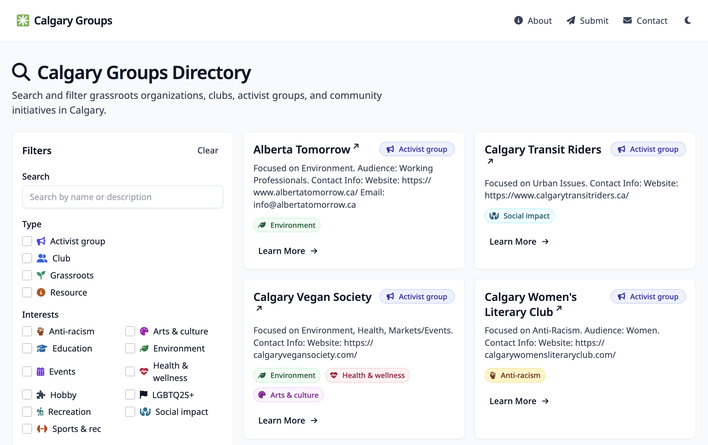

<p align="center">
   
 </p>

# Calgary Groups

Calgary Groups is a centralized, searchable directory to help Calgarians find grassroots organizations, clubs, activist groups, and community initiatives.



This repo contains:

- A static website built with **11ty + Tailwind CSS + Alpine.js**
- Organization listings stored as **markdown files in Git** (full data ownership)
- Helper scripts for importing data from the CSVs in `docs/`

## Tech stack

- **Static site generator:** 11ty (Eleventy)
- **Styling:** Tailwind CSS
- **Interactivity:** Alpine.js
- **Hosting:** Netlify

## Local development

### Prerequisites

- Node.js **20** (see `.nvmrc`)
- npm

### Install

```bash
npm install
```

### Run dev server

```bash
npm run dev
```

Then open:

- `http://localhost:8080/`

### Production build

```bash
npm run build
```

Output is written to:

- `_site/`

## Content editing

Organization files live here:

- `src/content/organizations/`

Each organization is a markdown file with front matter.

Example:

```md
---
name: "Organization Name"
type: "club" # club, activist-group, resource, grassroots-initiative
interests: ["arts-culture", "social-impact"]
age_range: "all-ages" # youth, young-adult, all-ages, seniors
identity_focused: false
meeting_format: "in-person" # in-person, online, hybrid
location_area: "city-wide" # northwest, northeast, southwest, southeast, downtown, online, city-wide
status: "active" # active, inactive, seasonal
---

Short description here.

**Contact Info:**
- Website: https://example.com
- Email: contact@example.com
```

### Folder conventions

- `src/content/organizations/clubs/`
- `src/content/organizations/activist-groups/`
- `src/content/organizations/grassroots-initiatives/`
- `src/content/organizations/resources/`

File naming convention:

- lowercase
- hyphen-separated
- no spaces

## Import workflow (CSV -> markdown)

The `docs/` folder contains CSVs used for bulk import/maintenance.

### 1) Merge URLs from `docs/urls.md` into the Organizations CSV

This generates a new CSV with a `Website` column:

```bash
python3 scripts/merge_urls_into_csv.py --fuzzy
```

Default output:

- `docs/Mass Organization CRM - Organizations.with_urls.csv`

### 2) Convert CSV rows into organization markdown files

```bash
python3 scripts/csv_to_organizations.py \
  --csv "docs/Mass Organization CRM - Organizations.with_urls.csv" \
  --only-site-flag Y
```

Notes:

- The script uses conservative defaults for fields we don’t have yet (e.g. `location_area`, `meeting_format`).
- Type and interest mappings are heuristics that you can refine over time in `scripts/csv_to_organizations.py`.

## Deployment (Netlify)

This repo includes `netlify.toml`.

- **Build command:** `npm run build`
- **Publish directory:** `_site`
- **Node version:** 20

## Repo hygiene

- `TODO.md` tracks planned work.
- `CHANGELOG.md` tracks notable changes.

## License

This repository is dual-licensed:

- **Code** (site source, scripts, configuration): **MIT** (see `LICENSE`)
- **Content/data** (organization listings and related data): **CC BY 4.0** (see `LICENSE-CONTENT`)
